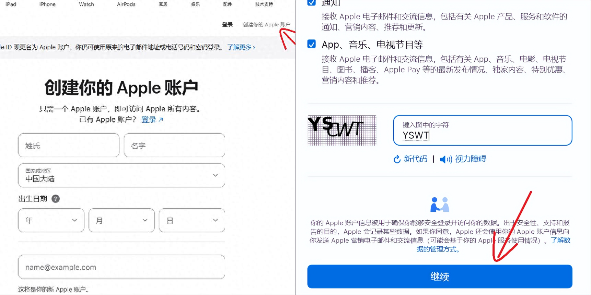
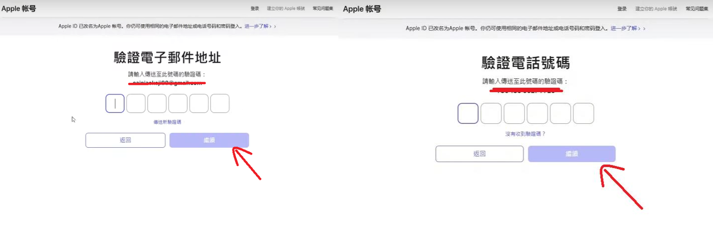
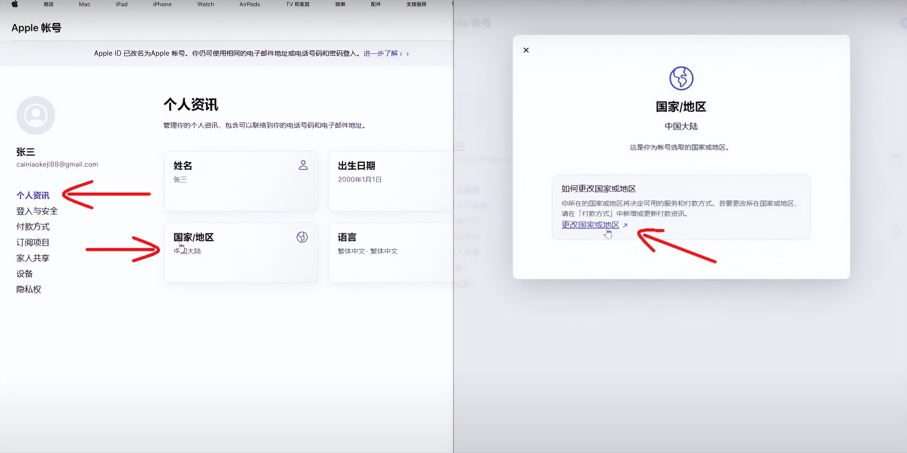
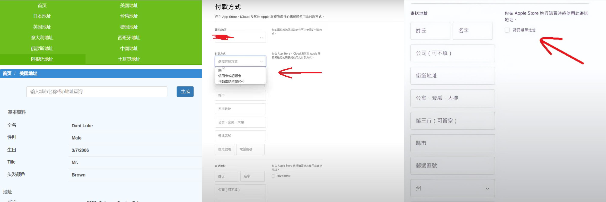
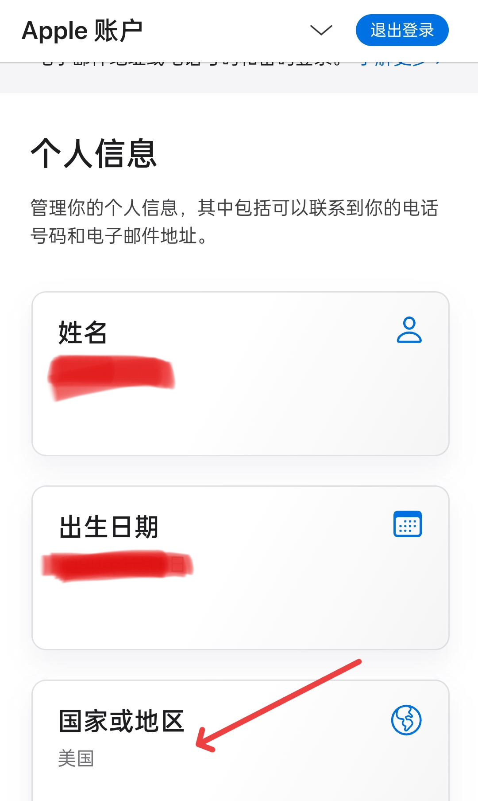

**首先，打开Apple的[官方网站](https://account.apple.com/)，并选择“创建你的账户”选项。确保你填写的所有个人信息都是真实的，因为这会影响到后续的验证和使用体验。填好信息后，点击“继续”。**
<!-- more -->

**接下来，Apple会向你注册时提供的邮箱发送一个验证码。收到验证码后，输入它以继续注册过程。之后，Apple会发送一个短信验证码到你的手机号码，再次输入验证码。**

**如果一切顺利，你的Apple ID此时就已经注册成功了。页面会跳转到你的个人主页。点击“个人信息”，然后选择“国家或地区”。接着，点击“更改国家和地区”。这会将你带到一个新的注册页面**

**此时，建议使用一个地址生成器，选择你希望将账户设置为的国家或地区，按顺序填写相关信息。如果你没有合适的付款方式，可以选择“无”。对于寄送地址这一步，如果不想详细填写，可以直接选择“拷贝账单地址”。**

**完成这些步骤后，点击“更新”。然后，在你的手机上再次登录Apple ID，以确保所有更改都已生效。现在，你可以去验证一下你的新Apple ID是否正常工作了。**

